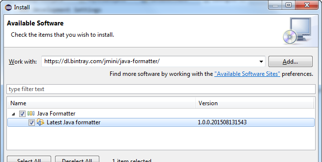
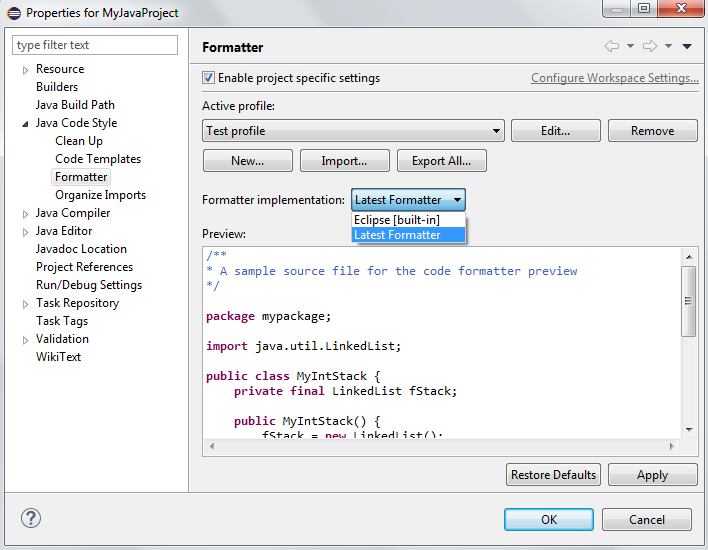

:issues: https://github.com/jmini/com.bsiag.eclipse.jdt.java.formatter/issues
:license: http://www.eclipse.org/legal/epl-v10.html
:jdt.core.repo: http://git.eclipse.org/c/jdt/eclipse.jdt.core.git
:bugzilla_query: https://bugs.eclipse.org/bugs/buglist.cgi?component=Core&product=JDT&resolution=---
:bugzilla_new: http://bugs.eclipse.org/bugs/enter_bug.cgi?product=JDT&component=Core

= com.bsiag.eclipse.jdt.java.formatter

Latest version of the JDT Java formatter for Eclipse Mars

== Description

The new java formatter is one of the new features introduced with the Mars version of Eclipse IDE.
Like with any new piece of software, the version released with the Mars release contains some bugs.
Lots of them have already been fixed (on the `master` branch of the JDT project). 

Since Mars, it is possible to select the *Formatter implementation* you like to use.
The goal of this project is to build and distribute the latest version of the Java formatter provided by the JDT (`master` branch) in order to use it now in your Mars IDE.

== Installation

In your Eclipse Mars IDE open _Install New Software..._ from the _Help_ Menu.
In the dialog set the Update Site to:

  https://dl.bintray.com/jmini/java-formatter/

Select the _Latest Java Formatter_ feature in the list and exit the dialog with _Next_ and _Finish_.

== Usage

Open the _Formatter_ preference page (Java Code Style) and select _Latest formatter_ in the _Formatter implementation_ combo box.

=== Build

The repository is built with maven and tycho.
The script produces a p2 update site that can be used to install the plugin in your Eclipse IDE.
Just run:

  mvn clean install

The result can be found here:

  /com.bsiag.eclipse.jdt.java.formatter-repository/target/repository-*.zip

==== Copy the latest version of the JDT sources

You can use the default ant task in this link:com.bsiag.eclipse.jdt.java.formatter-build/build.xml[build.xml] to do it.

* Checkout the link:{jdt.core.repo}[eclipse.jdt.core repository].
* Set the path to this repository in the `jdt.git.repo` property.
* Run the `default` ant task.

The task moves the source file to another package: `com.bsiag.eclipse.jdt.java.formatter`

== Issue Tracker

For this project use the link:{issues}[issue tracker] on GitHub.

For the formatter itself, check the bugs filed in the JDT project (they often use `formatter` in the bug title):

* link:{bugzilla_query}[list of open bugs]
* link:{bugzilla_new}[submit a new bug]

== License

link:{license}[Eclipse Public License - v 1.0]
